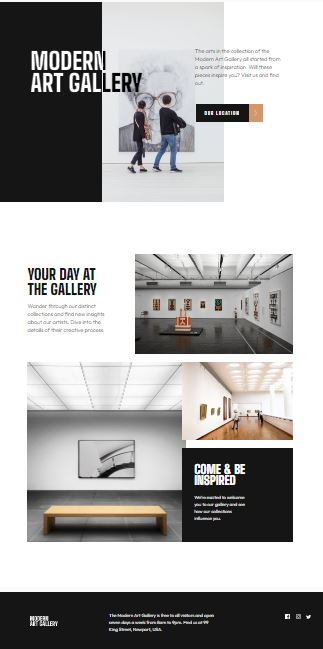
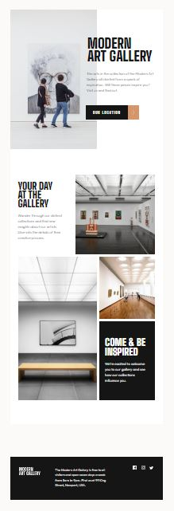
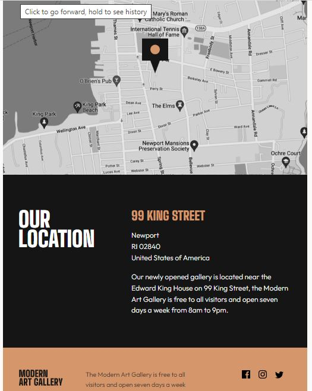
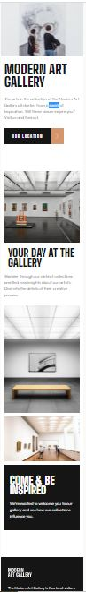
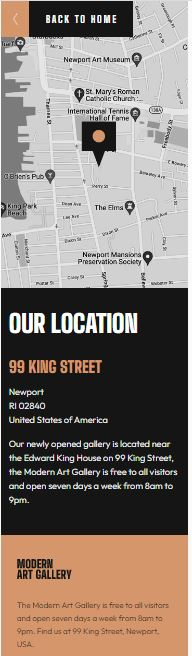

# Frontend Mentor - Art gallery website solution

This is a solution to the [Art gallery website challenge on Frontend Mentor](https://www.frontendmentor.io/challenges/art-gallery-website-yVdrZlxyA). Frontend Mentor challenges help you improve your coding skills by building realistic projects. 

## Table of contents

- [Overview](#overview)
  - [The challenge](#the-challenge)
  - [Screenshot](#screenshot)
  - [Links](#links)
- [My process](#my-process)
  - [Built with](#built-with)
  - [What I learned](#what-i-learned)
  - [Continued development](#continued-development)
  - [Useful resources](#useful-resources)
- [Author](#author)

## Overview

### The challenge

My challenge was to build out art gallery website and get it looking as close to the design as possible.

Users are able to:

- View the optimal layout for each page depending on their device's screen size
- See hover states for all interactive elements throughout the site


### Screenshot

Thiese are screenshots of desktop version of the site: , 
and these are tablet versions: , 
and here are mobile version screenshots: , 

Unfortunately I was not able to make full version screenshots because of the size of the pages. You can see them on Solution and Live Site links.


### Links

- Solution URL: [https://github.com/Aleqsa123/art-gallery]
- Live Site URL: [https://aleqsa123.github.io/art-gallery/]

## My process

### Built with

- Semantic HTML5 markup
- CSS custom properties
- Flexbox
- CSS Grid
- Mobile-first workflow


### What I learned

I learned to create responsive box, hide in on lower sizes and display on desktop version. Also, I learned to isert responsive html images, hide and display them at appropriate screen resolutions.
Creating and working on second page of the site was also challenging. I realized, that it is better to have separate stylesheet for separate html page, because it's confusing to style all pages in one css stylsheet.
Two colored background was surprise for me, and creating it also as hover, was beautiful. Huge challenge was filling text with two color. I used webkit and two color linear-gradient.
Filling svg images with another color was also challenge, but I did it by filter property and filter generating tool.
Most often I used position:relative property-value to arrange elements.

These are html and css codes I love most in the project:

```html
      
      
      
```
```css
.locationdiv {
    position: relative;
    display: flex;
    justify-content: left;
    align-items: center;
    margin-left: 1.6rem;
    left: -4.5rem;
    top: 0rem;
    background: linear-gradient(
    to right,
    #151515 0%,
    #151515 79%,
    #D5966C 79%,
    #D5966C 100%
  );
 }

 I love this css code:
    h1 {
        display: inline-block;
        grid-column: 1;
        grid-row: 1; 
        position: relative;
        height: 17.6rem;
        width: 45rem;
        left: 14.2rem;
        top: -21rem;
        font-size: 9.6rem;
        line-height: 8.8rem;
        padding: 0rem;
        background: linear-gradient(90deg, rgba(255,255,255,1) 64%, rgba(0,0,0,1) 64%);
        -webkit-background-clip: text;
        -webkit-text-fill-color: transparent;
        z-index: 1;
    }
```

### Continued development

I want to refine and perfect layout. I still have to study more positioning, grid and flex. Using javascript in projects will be also another level.


### Useful resources

(https://developer.mozilla.org/en-US/) and (https://www.w3schools.com/) - These are amazing sites which helped me in backgrounding and box layout.
(https://codepen.io/sosuke/pen/Pjoqqp) - This site generated filter combination, that I used then to fill svg images on hover state of the element.

## Author

- Fronendmentor - [Aleqsa123] (https://www.frontendmentor.io/profile/Aleqsa123)
- Github - [Aleqsa123](https://github.com/Aleqsa123)
- Linkedin - [Aleksi Merebashvili](https://www.linkedin.com/in/aleksi-merebashvili-36627426/)
- Facebook - [Aleksi Merebashvili](https://www.facebook.com/aleksi.merebashvili)
